# Apache Kafka Event Streaming System

This repository contains a complete, end-to-end event 
streaming architecture built with **Apache Kafka** and **Python**.
The project satisfies all requirements across three experimental phases of the programmatic producers/consumers, group rebalancing handling, poison-message processing, 
and an event-driven stream processing pipeline

## Requirements

- Python 3.10 or newer
- Kafka running on `localhost:9092`
- Packages from `requirements.txt`

## Setup Steps

Follow these steps in order on a clean machine.

### Step 1 — Install the Python dependencies with:


```powershell
pip install -r requirements.txt
```


### Step 2 — Start the Kafka broker

```powershell
docker compose up -d
```

Verify the broker started successfully:

```powershell
docker logs kafka | Select-String "started"
```

Expected output:
```
[KafkaServer id=1] started
```

To stop the broker later:

```powershell
docker compose down
```

### Step 3 — Install Python dependencies

```powershell
pip install -r requirements.txt
```

### Step 4 — Create Kafka topics

Run these once before executing any phase scripts:

```powershell
# Phase 2 topic
docker exec -it kafka /opt/kafka/bin/kafka-topics.sh --create --topic ecommerce.orders --bootstrap-server localhost:9092 --partitions 3 --replication-factor 1
 
# Phase 3 topics
docker exec -it kafka /opt/kafka/bin/kafka-topics.sh --create --topic ride.events --bootstrap-server localhost:9092 --partitions 3 --replication-factor 1
 
docker exec -it kafka /opt/kafka/bin/kafka-topics.sh --create --topic ride.completed --bootstrap-server localhost:9092 --partitions 3 --replication-factor 1
```

## Phase 2 - E-commerce Orders Pipeline

### Topics Used

 Topic used
`ecommerce.orders` 

### Workflow

```mermaid
flowchart 

   ecommerce_orders.csv
       ↓
   Producer
       ↓
   ecommerce.orders
       ↓
   Consumers
```

### Dataset

The producer reads from `data/ecommerce_orders.csv`. The CSV contains e-commerce order events with fields like:

- `order_id`
- `user_id`
- `product_id`
- `amount`
- `timestamp`

### 2.1 Producer

Reads the CSV and publishes each row to the `ecommerce.orders` topic, using `order_id` as the message key.

Run it with:

```powershell
python .\src\phase2\producer.py
```
## output 
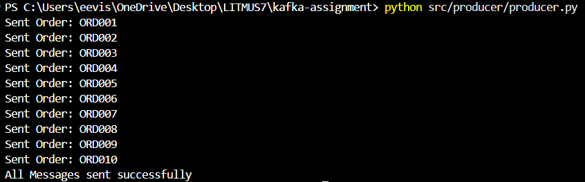

### 2.2 Consumer

Consumes from `ecommerce.orders`, prints each message, and keeps a running count of orders per `user_id`.

Run it with:

```powershell
python .\src\phase2\consumer.py
```
## output
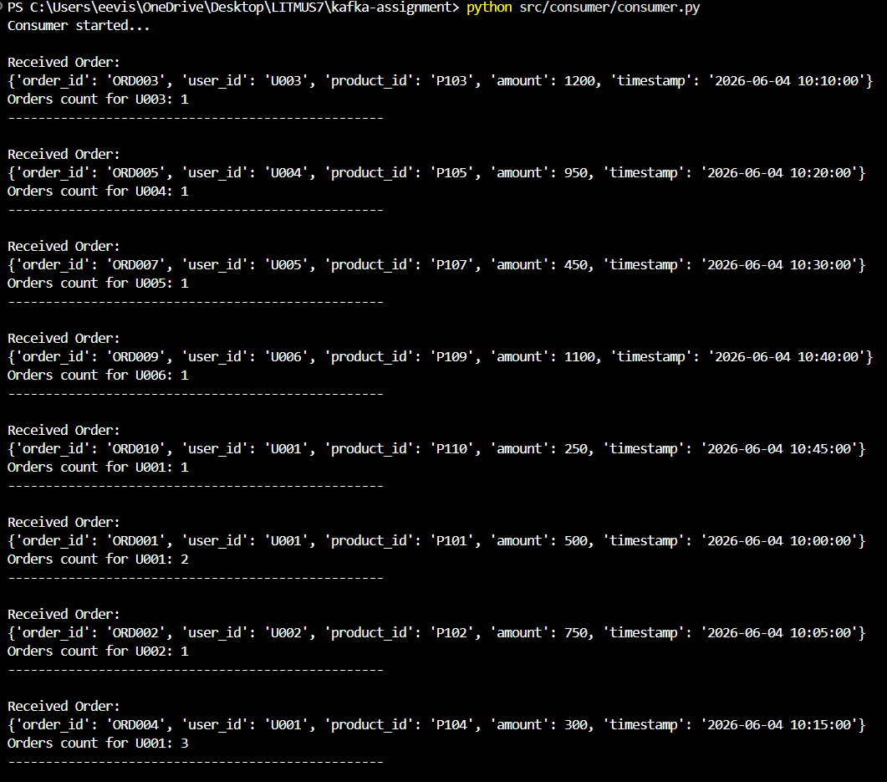


### 2.3 Consumer Rebalancing Demo

Run two instances of the rebalance consumer in the same group to show partition assignment changes.

Terminal 1:

```powershell
python .\src\phase2\consumer_rebalancing.py
```
## output
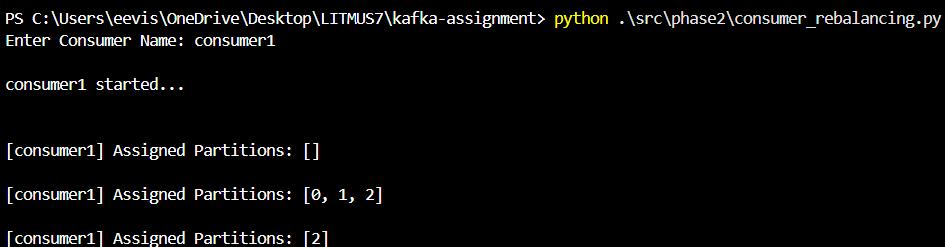

Terminal 2:

```powershell
python .\src\phase2\consumer_rebalancing.py
```
## output
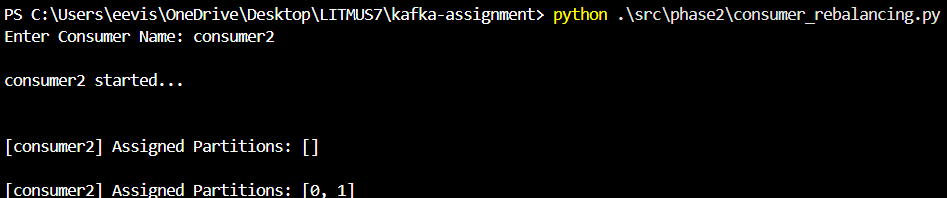

The script prints the current partition assignment for each instance so rebalance behavior is visible when a second consumer joins or leaves the group.

### 2.4 Poison Message Demo

`ProducerPoison.py` sends an invalid JSON payload to `ecommerce.orders`.

Run it with:

```powershell
python .\src\phase2\ProducerPoison.py
```
## output
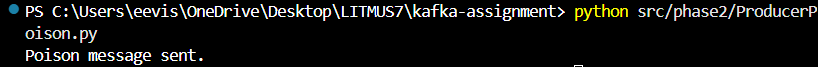

`ConsumerPoison.py` shows one way to skip poison messages without crashing the consumer.

Run it with:

```powershell
python .\src\phase2\ConsumerPoison.py
```
## output

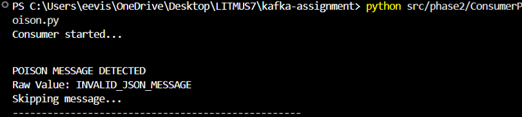

## Phase 3 - Ride Sharing Pipeline 

This mini project streams ride events and derives completed rides and driver earnings.

### Topics

- `ride.events` - input ride stream
- `ride.completed` - completed rides only
- `driver.earnings` - aggregated earnings by driver

### Workflow

```mermaid
flowchart TD
	ride.events (Producer sends ride data)
        ↓
  Ride Events Producer
        ↓
   ride.events (Kafka Topic)
        ↓
   Filter Consumer (keeps only COMPLETED rides)
        ↓
   ride.completed
        ↓
   Aggregation Consumer
        ↓
   driver.earnings
        ↓
   Top Drivers Output (CLI / Console)
```

### 3.1 Ride Producer

Produces synthetic ride events to `ride.events`.

Run it with:

```powershell
python .\src\phase3\ride_pipeline\ride_producer.py
```
## output

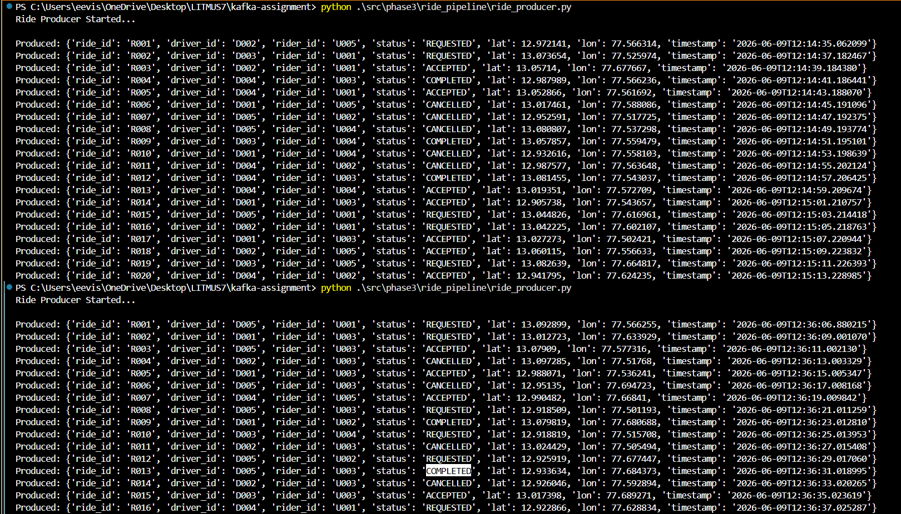


Optional idempotent/reliable producer variant:

```powershell
python .\src\phase3\ride_pipeline\ride_producer_idempotent.py
```
## output

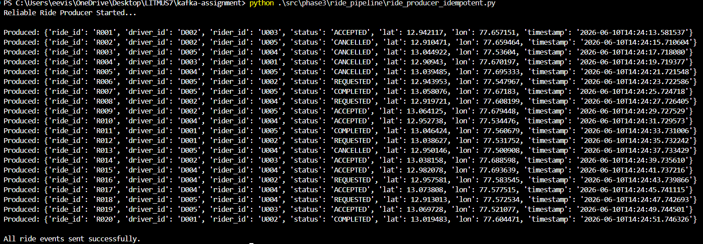

### 3.2 Completed Ride Consumer

Consumes from `ride.events`, filters only `COMPLETED` rides, and writes them to `ride.completed`.

Run it with:

```powershell
python .\src\phase3\ride_pipeline\completed_consumer.py
```
## output

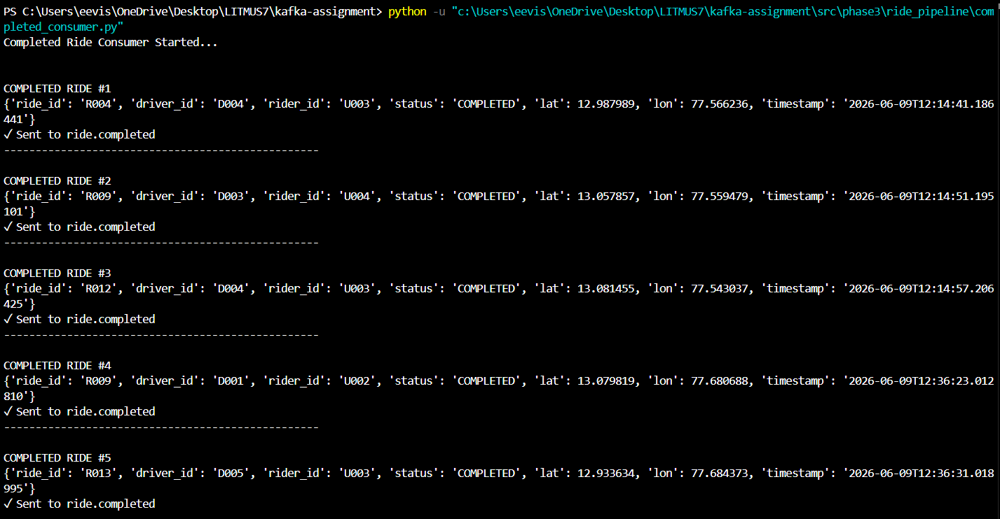


### 3.3 Driver Earnings Aggregator

Reads from `ride.completed` and prints estimated earnings per driver.

Run it with:

```powershell
python .\src\phase3\ride_pipeline\earnings_driver.py
```
## output

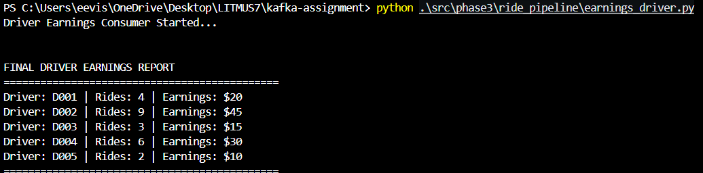

### 3.4 Top Drivers

Reads completed rides and prints the top 5 drivers by completed ride count.

Run it with:

```powershell
python .\src\phase3\ride_pipeline\top_drivers.py
```


## output

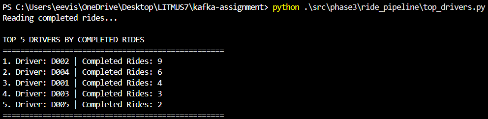

## Known Issues

### 1. `kafka-topics.sh` not found

**Symptom:**
```
bash: kafka-topics.sh: command not found
```

**Solution:** Use the full path inside the container:
```powershell
docker exec -it kafka /opt/kafka/bin/kafka-topics.sh
```
 
---

### 2. Topic deletion not immediate

Kafka marks topics for deletion asynchronously. If you immediately recreate a topic after deleting it, the old data may still exist briefly.

**Solution:** Wait a few seconds after deletion, or restart the broker:
```powershell
docker compose restart
```
 
---

### 3. Messages not distributed across partitions

**Cause:** Topic was created with only 1 partition, or messages were sent without a key (Kafka round-robins keyless messages).

**Solution:** Verify the partition count:
```powershell
docker exec -it kafka /opt/kafka/bin/kafka-topics.sh --describe --topic ecommerce.orders --bootstrap-server localhost:9092
```

Recreate with 3 partitions if needed, and always set `order_id` as the message key in the producer.
